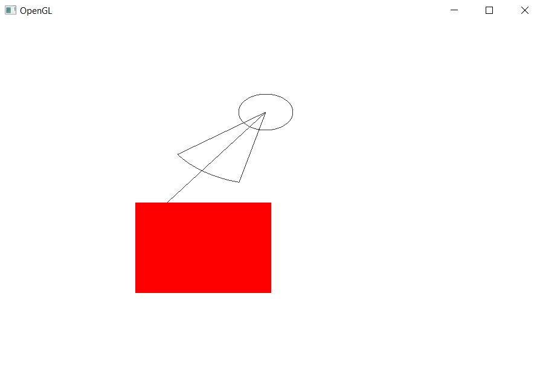
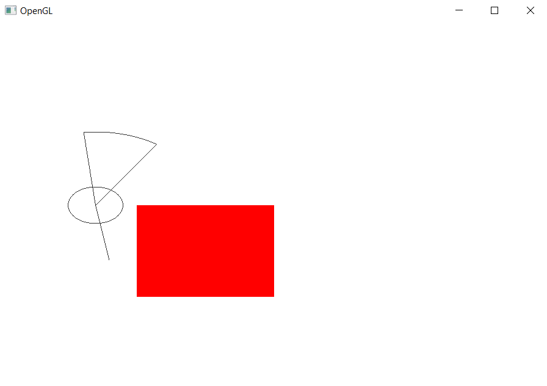
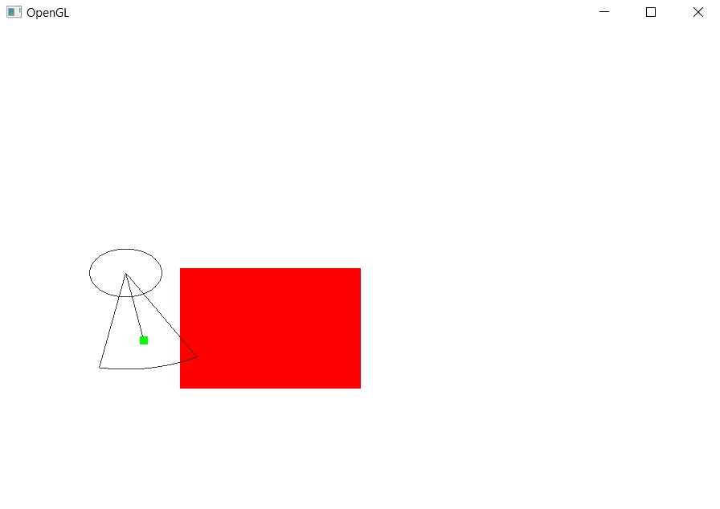

## 2D visibility tracing demo

This is a field of vision tracing test project

### Build and run

To attach *nix GL binaries put property:
```
  <lwjgl.natives>natives-linux</lwjgl.natives>
```
to the maven pom.

To build and run type:
```
./mvnw clean verify
java -jar ./target/2d-vision-1.0-SNAPSHOT.jar
```

### Behaviour

On these pics target point is hidden for observer:


At last, now target point is visible for observer: 

